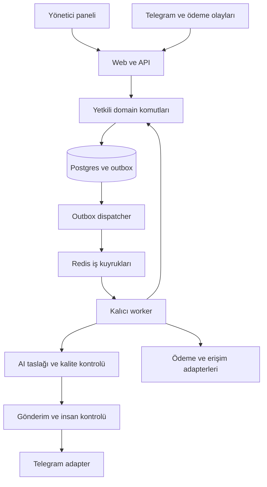

# Gold Revenue OS — TARGET ARCHITECTURE

Tarih: 12 Eylül 2026 · Durum: Phase 0 değişikliklerle onaylandı

Bu belge hedef tasarımı tarif eder. Listelenen klasör, servis, tablo ve testler henüz oluşturulmadı. Kaynak paketten ayrışan kararlar ayrıca işaretlenmiştir.

## 1. Mimari karar

**Tek pnpm workspace içinde modüler monolit; ayrı Next.js web/API ve kalıcı Node.js worker deploy birimleri. PostgreSQL iş gerçeğinin tek sahibi, Redis yalnız iş teslimatı ve geçici koordinasyon katmanı.**

Bu yapı customer, commerce, erişim ve intelligence bilgisini aynı kontrol düzleminde tutar; tenant bazlı ürünleşmeyi ve kanal/ödeme sağlayıcısı değişimini kolaylaştırır. MVP’de mikroservis, Kubernetes, Kafka veya bağımsız agent ağları eklemiyoruz. Bunların fırsat maliyeti, henüz doğrulanmamış gelir döngüsünden kapasite çekmek ve dağıtık hata yüzeyini büyütmektir.

Ölçüm worker iş yükünün ayrışmasını gerektirirse önce aynı koddan farklı queue worker grupları açılır. Domain’i ayrı servise çıkarma ancak bağımsız ölçek/SLA ihtiyacı ölçüldüğünde gündeme gelir.

## 2. Dağıtım ve işlem topolojisi

API request’i uzun agent zinciri çalıştırmaz. Dış webhook doğrulanıp DB’ye kalıcı olarak alındığında hızlı yanıtlanır; ödeme/erişim işlerinin devamı worker’da yürür. Kalıcı döngüler request ömrüne bağlanmaz. [Vercel Function sınırları](https://vercel.com/docs/functions/limitations), [Render background worker](https://render.com/docs/background-workers)

## 3. Servis ve bağımlılık kararları

“Seçildi” aşağıda teknik önerinin netliğini ifade eder; hesap satın alındığı veya provision edildiği anlamına gelmez. Bölge ve ücretli planlar henüz doğrulanmadı.

| Bileşen | Hedef seçim | Başlangıç | Gerekçe / sürüm yaklaşımı |
| --- | --- | --- | --- |
| Runtime | Node.js 24 LTS | Phase 1 | Web/CI/worker aynı major; resmi listede LTS. Patch kurulumda pin |
| Web | Next.js 16 ailesi, React 19 uyumlu sürüm, TS strict | Phase 1 | App Router, Node runtime, server-side auth; exact sürüm peer kontrolüyle |
| Workspace | pnpm workspace | Phase 1 | Tek lockfile, explicit package boundary; başlangıçta Turborepo gerekmiyor |
| UI | Tailwind CSS, shadcn/ui, lucide-react | Phase 1 | Login ve gerçek tenant shell; yalnız gereken bileşenler |
| Auth/DB | Managed Supabase Auth + PostgreSQL 17 hedefi | Phase 1 | Yerel CLI/Docker + ayrı staging/prod; seçilen proje major’ı doğrulanır |
| DB erişimi | supabase-js + @supabase/ssr, SQL migrations | Phase 1 | Kullanıcı JWT’siyle sorgu; atomik domain komutları için SQL fonksiyonları |
| Storage | Supabase private buckets | Phase 2 | Import/kanıt dosyaları; tenant path, limit, kısa ömürlü erişim |
| Kuyruk | BullMQ + ioredis; yönetilen TCP Redis uyumlu hizmet | Phase 3 | Hedef sağlayıcı Render Key Value; noeviction/persistence/plan uyumu doğrulanacak |
| Worker | Render Background Worker, Docker | Phase 3 | Uzun ömürlü süreç; Redis ile yakın bölge, bounded concurrency |
| Web hosting | Vercel | Phase 1 sonrası staging hedefi | Hesap/bölge doğrulanmadan deploy sonucu iddia edilmez |
| AI | OpenAI API, server-only adapter | Phase 6 | Model isimleri eval sonrası seçilir; iki model/env değişkeni bir performans garantisi değildir |
| Müşteri kanalı | Telegram Bot API, ince HTTP adapter | Phase 5 | İlk desteklenen mod: müşteri başlatmalı standart bot; business/secretary modları ayrı değerlendirme |
| Admin bildirim | Ayrı Telegram admin botu | İlk güvenli outbound öncesi | Tenant admin destination allowlist; PII yerine kısa vaka özeti/deep link |
| Ödeme | Provider-neutral, crypto-first PaymentAdapter | Phase 10 | Kripto temel yön; nihai sağlayıcı ödeme fazında seçilecek |
| Auth e-posta | Supabase Auth + Resend custom SMTP hedefi | Staging davet/kurtarma öncesi | Yerelde mail catcher; domain sahipliği/SMTP doğrulaması gerekir |
| İzleme | JSON/Pino log; Sentry entegrasyonu hedefi | Phase 1 temel; worker’da genişler | request/correlation ID ve redaction; audit’in yerine geçmez |
| Doğrulama | Zod, Vitest, Playwright, Supabase CLI/pgTAP | Phase 1 | API şeması, unit, tarayıcı ve gerçek RLS/DB testleri |
| İleri bağımlılıklar | pg, decimal.js, libphonenumber-js, streaming CSV parser | İlgili faz | Worker DB rolü, kesin tutar aritmetiği ve import için; ihtiyaç gelmeden kurulmaz |

Node 24 tercihi resmi LTS durumuna dayanır. Supabase’in Node 20 desteğini kaldırması nedeniyle sadece Next.js minimum gereksinimini karşılamak yeterli değildir. [Node sürümleri](https://nodejs.org/en/about/previous-releases), [Supabase Node 20 duyurusu](https://supabase.com/changelog/45715-deprecation-notice-dropping-support-for-node-js-20)

Next.js kurulumu, framework/React uyumu ve ayrı lint komutu kurulum belgelerine göre doğrulanacaktır. Lockfile oluşmadan exact bağımlılık seti test edilmiş sayılmaz. Seçilen CLI sürümü, TS sürümü (en az 5.1), SBOM ve güvenlik taraması Phase 1 raporuna yazılır. [Next.js installation](https://nextjs.org/docs/app/getting-started/installation)

Render Redis planının BullMQ için gerekli eviction ve dayanıklılık ayarlarını karşılaması bir provisioning kabul koşuludur; karşılamıyorsa aynı adapter ile uygun yönetilen Redis seçilir. BullMQ `noeviction` ister; retry edilen işler uygulama tarafında da idempotent tasarlanır. [Üretim ayarları](https://docs.bullmq.io/guide/going-to-production), [Idempotent jobs](https://docs.bullmq.io/patterns/idempotent-jobs)

Render Key Value yeni kurulumlarda Valkey 8 tabanlı Redis uyumlu hizmet sunuyor; noeviction seçilebiliyor ve disk persistence ücretli planlarda mevcut. Hedef, persistence açık ücretli queue instance’ıdır; ücretsiz cache planı dayanıklı iş kuyruğu kabul edilmez. Dispatcher/worker Render içinde Redis’e erişir; web yalnız Postgres outbox’a yazar, Redis’i Vercel’e açma ihtiyacı doğmaz. Internal authentication açılır; dış erişim kapalı tutulur. [Render Key Value](https://render.com/docs/key-value)

Resend’in Supabase custom SMTP entegrasyonu belgelenmiştir; bu seçim Auth davet/kurtarma e-postası içindir. SMTP kurulumu ve domain doğrulaması sonraki ortam hazırlığının parçasıdır. [Resend Supabase SMTP](https://resend.com/docs/send-with-supabase-smtp)

## 4. Greenfield hedef repository yapısı

Önerilen repository adı: `gold-revenue-os`. Aşağıdaki yollar repository köküne göredir; bir dosya sistemi oluşturma talimatının bu fazda uygulandığı anlamına gelmez.

| Yol | Sorumluluk | İlk oluşum |
| --- | --- | --- |
| AGENTS.md | Mühendislik sınırları, onay kapıları, source-of-truth yolu | Phase 1 |
| README.md | Çalıştırma, mimari, faz durumu | Phase 1 |
| package.json, pnpm-workspace.yaml, pnpm-lock.yaml | Workspace/sürümler | Phase 1 |
| tsconfig.base.json, eslint.config.mjs | Strict tip ve import sınırları | Phase 1 |
| docs/source-of-truth/v1.0.0/ | ZIP’teki 18 dosyanın değişmeden arşivi + checksum envanteri | Phase 1 |
| docs/phase-0/ | Bu dört çıktı | Phase 1 |
| docs/adr/ | Onaylanan kararlar ve kaynak çelişki çözümleri | Phase 1+ |
| docs/phases/PHASE_1_REPORT.md | Test, migration, sınır, rollback, sonraki onay | Phase 1 sonunda |
| apps/web/src/app/ | Login, tenant shell, API Route Handlers | Phase 1 |
| apps/web/src/components/ | UI, erişilebilirlik, responsive layout | Phase 1 |
| apps/web/src/lib/auth/, apps/web/src/proxy.ts | SSR session ve yönlendirme; asıl authz servislerde | Phase 1 |
| apps/worker/src/ | Dispatcher, scheduler, job consumers, process lifecycle | Phase 3 |
| packages/contracts/src/ | Zod API/event/tool şemaları, sürümler, hata kodları | Phase 1 dar kapsam |
| packages/domain/src/ | authz, tenancy, audit; sonra customer/commerce/access/escalation | Phase 1 dar kapsam |
| packages/db/src/ | DB client, generated types, transaction/komut repository’leri | Phase 1 |
| packages/config/src/ | Sürece göre env validation, secret/public ayrımı | Phase 1 |
| packages/observability/src/ | Correlation, redaction, log wrapper | Phase 1 |
| packages/integrations/src/ | telegram, payment, model adapterleri | Phase 5+ |
| packages/agent-runtime/src/ | Tool registry, context builder, eval/version/cost | Phase 6 |
| supabase/config.toml, supabase/migrations/ | Şema ve local service config | Phase 1 |
| supabase/tests/, supabase/seed.sql | Tenant/RLS testleri ve yalnız sentetik seed | Phase 1 |
| tests/integration/, tests/e2e/ | Yetkili işlem ve uçtan uca akış | Phase 1 |
| tests/evals/, tests/load/ | Konuşma regresyonu ve kapasite | Phase 6+, pilot öncesi |
| infra/worker/, infra/runbooks/ | Container, süreç/restore/secret yönetimi | Phase 3+; runbook temeli Phase 1 |
| .github/workflows/ | Secret tarama, lint/typecheck/test/build ve migration CI | Phase 1 |

Root AGENTS.md ürün agent kataloğunu kaybetmemeli; orijinal `docs/source-of-truth/v1.0.0/AGENTS.md` dosyasına açık referans vermeli. Scaffold’ın ürettiği AGENTS dosyası kaynak kuralları otomatik olarak geçersiz kılamaz.

Bağımlılık yönü: UI → API/application → domain/contracts; DB/integrations domain portlarını uygular. Domain React/Next/Telegram SDK import etmez. Worker web uygulamasını import etmez. `server-only` sınırı secret içeren modüllerin client bundle’a girmesini engeller. Ayrı ORM migration sistemi kurulmaz; SQL migrations tek şema kaynağıdır.

## 5. Tenant, kimlik, yetki ve audit

### 5.1 Yetki modeli

Supabase Auth kullanıcı kimliğini doğrular; iş yetkileri DB üyeliklerinden gelir. Browser tenant seçebilir, fakat tenant_id gönderdiği için yetki kazanmaz. Session doğrulama, güncel üyelik, permission ve hedef satır tenant eşleşmesi her istekte kontrol edilir. JWT user_metadata yetki kaynağı yapılmaz. Tenant verisi public/shared cache’e yazılmaz.

| Aktör | İzin çerçevesi | Varsayılan sınır |
| --- | --- | --- |
| Platform Super Admin | Tenant açma/dondurma, kritik sistem yönetimi | Ayrı platform_admins kaydı, MFA, açık hedef tenant ve audit |
| Manager | Kendi tenant müşterileri ve operasyonu | Ekonomik override/export/policy publish ayrı capability gerektirir |
| Support | Kendi tenant konuşma/vaka işlemleri | Fiyat, ödeme doğrulama ve manuel ekonomik override yok |
| Analyst | Onaylı toplulaştırılmış raporlar | Ham konuşma, PII, secret ve yazma yok |
| Readonly | Sınırlı maskeli operasyon görünümü | Yazma/export/secret yok |
| Agent Worker | İşe özel araç/capability | İnsan hesabı değil; arbitrary SQL/prompt/tool yok |

Önerilen kaynak düzeltmesi: `super_admin` globaldir, tenant üyeliği rol atama endpoint’inden verilemez. `tenant_members` manager/support/analyst/readonly tutar; global ayrıcalık `platform_admins` tablosundadır. Tenant sayısının bir olması tenant izolasyonunu kaldırmaz. Platform-wide audit kayıtlarında null tenant yalnız izinli platform action’larında kullanılabilir.

### 5.2 Veri erişimi

Kullanıcı okuması doğrulanmış JWT + RLS ile yapılır. Normal business mutation’larda browser’a doğrudan tablo yazma grant’i verilmez. Atomik komutlar dar RPC sözleşmesiyle yürür: doğrulama → güncel üyelik/permission → mutation → audit aynı transaction. Özel yetki gerektiren fonksiyonların implementasyonu private şemada, sabit search_path ve sınırlandırılmış EXECUTE ile tutulur; API’deki wrapper yalnız incelenmiş komuta erişir. SECURITY DEFINER sadece bu zorunlu dar işlemler için, fonksiyon içinde kimlik/tenant kontrolüyle kullanılabilir.

Worker ayrı DB rolüyle yalnız gereken fonksiyonları çalıştırır; RLS’yi aşan genel service role agent runtime’a verilmez. Worker principal, job içeriğini yetki kabul etmez; tenant/connector bağlantısını kalıcı job kaydından doğrular. Transaction-local context kullanılırsa pool’daki sonraki isteğe taşınmaması test edilir.

RLS’ye ek olarak tenant kaynaklar `(tenant_id,id)` unique key ve aynı kapsamlı FK’larla bağlanır. Customer/conversation/message ilişkileri yalnız aynı tenant olmakla kalmaz, aynı müşteri/conversation zincirine ait olmalıdır. Atanan kullanıcı tenant üyeliğine bağlıdır. UPDATE için satırın eski ve yeni kapsamı doğrulanır.

Yeni Supabase tablolarının Data API’ye otomatik açıldığı varsayılmaz; schema/table/function grants migration’da açıkça yazılır. [Data API değişiklik duyurusu](https://supabase.com/changelog/45329-breaking-change-tables-not-exposed-to-data-and-graphql-api-automatically)

### 5.3 Audit ve silme

Audit append-only ve uygulama rollerine UPDATE/DELETE kapalıdır. Başarılı ayrıcalıklı mutation ile audit aynı transaction’da commit olur. Reddedilen istekler ayrı güvenlik kaydı olarak yazılır; rollback edilen transaction içine bırakılıp kaybolmaz. Audit yazılamıyorsa ayrıcalıklı işlem gerçekleşmez.

Audit before/after verisi allowlist ile minimize edilir; secret, session, ham ödeme payload’ı ve bütün konuşmalar kopyalanmaz. Finansal/event/history/audit için kör cascade yerine kontrollü tenant kapatma, retention ve gerektiğinde PII ayrıştırma/pseudonymization süreci tasarlanır. Hukuki saklama süresi bu teknik dokümanda icat edilmez; işletme ülkesi ve kullanım amacı doğrulanmadan production veri politikası tamamlanmış sayılmaz.

## 6. Olay, idempotency ve hata modeli

Her olayda `id, tenant_id, type, schema_version, aggregate_type, aggregate_id, aggregate_version, occurred_at, correlation_id, causation_id, actor, payload` bulunur. ID/tenant/actor modele veya dış request gövdesine güvenilerek oluşturulmaz.

1. Gelen sağlayıcı olayının kimliği/signature veya Telegram secret header doğrulanır. `(connector_id, external_event_id)` receipt ile kalıcı alınır; tenant connector’dan çözülür.
2. Domain mutation + event + outbox + audit aynı DB transaction’ına yazılır.
3. Dispatcher kısa DB lease ile outbox işler; queue publish sonrası işaretlemede çökse bile tekrar yayın güvenlidir.
4. Consumer `(tenant_id,consumer_name,event_id)` benzersiz receipt’i domain değişimiyle aynı transaction’da commit eder. Sıralama aggregate version ile korunur.
5. Retry/backoff/jitter, attempt limit ve DLQ uygulanır. Retry edilemez validasyon hatası REVIEW/case’e gider. Operatör replay’i permission, gerekçe ve audit ister.
6. Redis kaybolsa da DB outbox/receipt ve reconciliation işlerinden iş yeniden üretilir. Redis mali/abonelik gerçeğinin sahibi değildir.

Teslimat **at-least-once**, hedef **tek ticari etki**dir; ağ genelinde exactly-once vaat edilmez. Dış ödeme çağrısı sağlayıcının idempotency key desteğiyle yapılır; belirsiz timeout’ta aynı satış yeniden oluşturulmadan status sorgulanır. Transaction boyunca dış HTTP/LLM beklenmez.

## 7. Müşteri state’i, ödeme ve entitlement ayrımı

Customer.state satış yolculuğunun özetidir. Payment.status, Subscription.status ve gerçek channel membership ayrı gerçeklerdir. Aktif müşteri yenileme ödemesi yaparken erişimi sürmelidir; satış state’inin PAYMENT_PENDING olması erişimi otomatik düşürmemelidir.

| Konu | Önerilen kural | Karar zamanı |
| --- | --- | --- |
| İlk satış | PAYMENT_PENDING→PAID yalnız verified payment; subscription ayrı oluşturulur | Phase 3 sözleşme, Phase 10 uygulama |
| Trial satın alma | Trial hakkı ödeme denemesinde sürer; trial→INTERESTED→PAYMENT_PENDING yolu ve verified completion | Phase 3; kaynak kısayolu ADR ile çöz |
| Erken yenileme | Abonelik transaction’ı `max(now, mevcut ends_at)` üzerinden onaylı süre ekler | Phase 9–11 |
| EXPIRED/WINBACK/late payment | Yeni offer/payment veya manual REVIEW; eski event state’i geriye zorlamaz | Phase 3 geçiş tablosu |
| MANUAL_HOLD | Ayrı hold flag/reason/actor/expiry; auto-grant bloke; mevcut erişime etkisi explicit policy | Phase 9–11 |
| İade/charge reversal | Payment düzeltmesi + entitlement yeniden değerlendirme; AI karar vermez | Phase 10–11 |
| Çoklu ürün | Phase 1+ model tenant/product kapsamlı; MVP tek ana ürün akışı. Customer.state tüm abonelikleri temsil etmez | Phase 9 öncesi |

Tam transition matrisi her kenar için actor/event/guard/idempotency/side effect/failure tanımlar; liste dışı geçiş reddedilir. State version + row lock/compare-and-swap eşzamanlı çift ilerlemeyi engeller. Event etkisi bir transaction’da state history’ye bağlanır. Geçerli fakat sıra dışı ödeme olayı kaybolmaz; reconciliation/review’e alınır.

## 8. Ödeme ve Telegram erişimi

`PaymentAdapter` yetenekleri: intent oluştur, webhook normalize/doğrula, status getir, reconcile, destekleniyorsa refund. Domain tarafı `provider`, `provider_account_id`, `charge_id`, `settlement_reference`, `amount`, `asset`, `scale`, `status` tutar; `tx_hash` ve network kriptoya özel opsiyonel ayrıntılardır. Katalogdaki payment.confirmed yalnız tx_hash’a bağımlı olmaktan çıkarılmalıdır.

Mimari crypto-payment-first kalır ve tek sağlayıcıya bağlanmaz. Telegram Stars varsayılan ödeme mimarisi değildir. Kripto sağlayıcısı seçimi; satıcı ülke/şirket, sinyal hizmetini kabul, desteklenen ağ/asset, sandbox, doğrulama, idempotency, settlement/refund ve ücret kanıtı tamamlanmadan kesinleştirilemez.

Tek ödeme/fatura kimliği yeterli değildir: immutable order/offer snapshot, payment attempt, provider charge unique, settlement allocation ve fulfillment key gerekir. Aynı kaynak ödemenin farklı ürünleri kapsaması gelecekte order line üzerinden modellenir; MVP’de tek ürün kısıtı açık olur. Kripto tutarlar atomic-unit integer/decimal string + scale ile hesaplanır; JavaScript floating point kullanılmaz. Under/overpayment, geç ödeme, yanlış ağ, eksik confirmation ve reorg REVIEW politikası ister.

Access Engine uygun subscription/trial/manual entitlement kanıtıyla **desired access** üretir. Invite oluşturulması erişim verilmesi değildir. Hesaba bağlı kısa ömürlü link/join request, Telegram user ID kontrolü ve üyelik gözlemi sonrası observed access ACTIVE olur. Invite başkasına aktarılsa da yanlış user onaylanmaz. Revoke/yeniden katılma, bot admin yetkisi kaybı ve subscription sonrası grant başarısızlığı reconciliation + escalation ile ele alınır.

Telegram adapter’da inbound update kimliği connector kapsamında; mesaj kimliği chat/connector kapsamında tutulur. Webhook’ta `X-Telegram-Bot-Api-Secret-Token` kontrol edilir. Dış mesajda belirsiz timeout otomatik yeniden gönderilmeden UNKNOWN olarak işaretlenir; sağlayıcı API’sinde genel bir send idempotency garantisi varsayılmaz. [Telegram Bot API](https://core.telegram.org/bots/api)

## 9. Konuşma, agent ve insan devralması

Gelen içerik önce persist edilir, erken critical/human-request kontrolünden geçer; uygun context ile intent→director→specialist→renderer→QA çalışır. Çıkıştan hemen önce risk ve gönderim yetkisi tekrar kontrol edilir. Director/renderer MVP’de pipeline fonksiyonudur; sekiz ürün rolü sekiz sürekli çalışan otonom servis gerektirmez.

Her taslak `prompt_version, renderer_version, qa_version, kb_version, policy_version, model, context_version, tools/evidence, token_usage, latency` taşır. KB approved/effective olmalı; fiyat ve payment/access durumu güncel backend verisinden gelir. QA skorları kalibrasyon gerektiren heuristiktir, doğruluk olasılığı değildir. Rewrite sayısı ve toplam token/time budget sınırlıdır; sonuç alınamazsa insan incelemesi.

Customer/KB/import içeriği güvenilmeyen veri olarak işlenir. Prompt injection tool yetkisini değiştiremez. Araç argümanları Zod ile doğrulanır; tenant/actor sunucudan eklenir; fiyat değiştirme ve access request’i de backend policy’yi geçer. Model yalnız ihtiyaç duyduğu azaltılmış context’i görür; secrets, raw auth ve payment credentials görmez.

### Gönderim ve takeover yarış koşulu

Conversation için tek sender coordinator, durable send intent ve artan `automation_epoch` kullanılır. Takeover kilit altında pause + epoch artışı + pending intent invalidation + audit oluşturur. Son sender kontrolü epoch, customer pause, conversation mode, tenant kill switch, eligibility ve taslak onayını doğrular. Eski worker sonucu gönderilemez. Yalnız queue job silmek yeterli değildir.

Başlamış HTTP gönderimi platform tarafından geri alınamayabilir. UI bu işi “gönderimde” gösterir; takeover’dan sonra yeni AI gönderimi başlatılmaz, önceden başlamış işin kesin sonucu kayda alınır. “Anında devralma” bu sınırla ölçülür; sıfır in-flight mesaj garantisi verilmez.

HIGH/CRITICAL durumda auto-send kapatılır. Kritik geçici yanıt, pause sırasında yalnız idempotent ve onaylı escalation-service istisnasıdır; insan devraldıktan sonra AI yanıtı gönderilmez. Return-to-AI resolution summary, yetki ve yeni epoch ister. Followup’lar topluca salınmaz; bağlam/uygunluk yeniden hesaplanır. Shadow modda taslak gönderilemez; approve/edit/reject ayrı permission ve audit ile kaydedilir.

## 10. Güvenlik ve ölçek sınırları

| Risk | Tasarım kontrolü | Doğrulama kapısı |
| --- | --- | --- |
| Tenant veri sızıntısı | RLS, scoped FK, güncel permission, tenant-aware cache | Phase 1 iki tenant negatif test |
| Secret sızıntısı | Sürece göre env, vault/secret ref, rotasyon, log redaction | Phase 1 bundle/log kontrolü; entegrasyonda tekrar |
| Agent yetki aşımı | Whitelisted tools, server-injected scope, policy evidence | Phase 6 injection/cross-tenant eval |
| Kuyruk tekrarı/çökme | Outbox/receipt/lease + DB business unique | Phase 3 crash/replay test |
| Kontrolsüz maliyet | Tenant model bütçesi, concurrency, rate limit, circuit breaker | Phase 6 quota ve bütçe test |
| Büyük tenant diğerlerini engeller | Queue önceliği/adil sıra, tenant token bucket | Pilot öncesi iki tenant yük deneyi |
| Büyük import bellek tüketir | Streaming parse, chunk/limit, dosya karantina | Phase 2 sentetik büyük dosya |
| Kimlik hatalı birleştirme | Exact normalized identity, provenance, conflict review | Phase 2 merge/unmerge senaryosu |
| Kanal/sağlayıcı kesintisi | Bounded retry, UNKNOWN/REVIEW, reconciliation | İlgili entegrasyon fazı |
| DB bağlantı tükenmesi | Web için pool, worker bounded pool, kısa transaction | Staging load ve EXPLAIN |
| Veri kaybı | Yedek/PITR planı ve gerçek restore provası | Gerçek ödeme pilotundan önce |

Her tenant için locale, timezone, fiyat/para birimi, connector, retention ve branding yapılandırması ayrılır. UTC persistence ve tenant timezone sunumu kullanılır. Veri başka tenant veya global eval havuzuna otomatik taşınmaz. White-label ticari ürünleştirmesi Phase 18’de kalır; izolasyon Phase 1’de başlar.

## 11. Kapasite, işletim ve maliyet

Ölçek kanıtı bulunmuyor. Tasarım hedefleri aşağıdakilerdir; ölçülmüş sonuç veya satıcı SLA’sı değildir:

| Ölçüm | İlk hedef / davranış |
| --- | --- |
| Foundation API | Sentetik 2 tenant, toplam 20 eşzamanlı session’da basit yetkili read p95 < 500 ms; CI değil staging ölçümü |
| Webhook alımı | Geçerli olayı kalıcı aldıktan sonra p95 < 2 s; LLM beklemez |
| Takeover | Kontrol işlemi p95 < 1 s; commit sonrası yeni AI send başlangıcı 0 |
| Worker backlog | Kritik payment/access işi ayrı öncelik; en eski kritik iş > 30 s ise alarm |
| Ödeme→erişim | Sağlayıcı final confirmation’dan sonra sağlıklı platformda hedef p95 < 60 s; chain bekleme hariç |
| Recovery | Ödeme pilotu için öneri RPO ≤ 5 dk, RTO ≤ 60 dk; destekleyen plan + restore provası şart |

İlk pilot 10→25→50→100 ile kalır. Load testleri gerçek toplu mesaj yerine sentetik/sandbox adapter kullanır. Gönderim bütçesi bot/chat/tenant/customer bazlıdır; Telegram 429 retry_after dikkate alınır. Referans oranlar adapter config’inde tutulur, büyüme kararı limit testlerinden sonra alınır. [Telegram rate limits](https://core.telegram.org/bots/faq#how-do-i-avoid-hitting-limits)

Maliyet modeli: sabit DB/web/worker/Redis/SMTP/izleme gideri + LLM input/output/eval + veri/egress + provider/settlement gideri + insan review süresi. Fiyat teklifi veya doğrulanmamış aylık tutar verilmez. İzlenecek temel birimler: qualified müşteri başına maliyet, ödeme başına net katkı, tenant brüt marjı, rewrite oranı, insan vaka süresi, erişim arızası süresi. Bu ölçümler satış hacmi artarken sermaye tüketen segmentleri görünür kılar.

## 12. Karar kaydı ve sınırlar

| Karar | Durum |
| --- | --- |
| Merkezi Customer OS / deterministik para, state ve access | Kaynakla uyumlu, korunacak |
| Modüler monolit + web/worker ayrımı | Önerilen teknik somutlaştırma |
| Tenant/auth/audit önce; tüm DDL’yi baştan kurmama | Phase 1 kapsam önerisi |
| Platform admin ayrı tablo/izin alanı | Kaynak belirsizliğini çözen öneri |
| Contact eligibility ve müşteri başlatmalı Telegram giriş | Phase 5 öncesi kabul gerektiren ürün netleştirmesi |
| Crypto-first + provider-neutral payment | Onaylandı; nihai kripto sağlayıcısı Phase 10’da seçilecek |
| Erken minimum escalation ve pilot öncesi hardening | Yol haritasında gerekçeli güvenlik bağımlılığı düzeltmesi |
| Exact package pins, plan/bölge, model, crypto provider | İlgili fazda doğrulanacak; hazır varsayılmıyor |

Phase 1 onayı bu hedefin yalnız Foundation dilimini uygulama yetkisi verir. Sonraki fazları veya production otomasyonunu başlatmaz.
