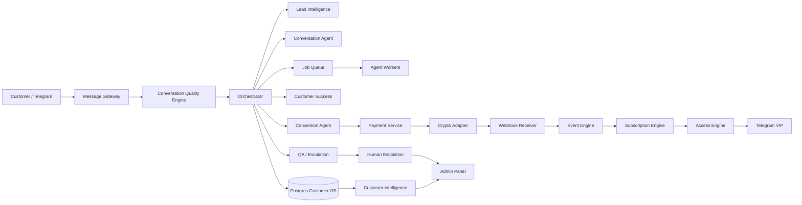

# ARCHITECTURE

## Deterministic vs AI
### AI
- intent/sentiment
- qualification
- response drafting
- summarization
- next-best-action proposal
- insight generation

### Deterministic backend
- pricing source-of-truth
- payment verification
- subscription dates
- access grant/revoke
- state transition guards
- permissions
- idempotency
- audit

## Agent Tool Boundary
Agent doğrudan DB mutate etmez; whitelisted tool çağırır:
- get_customer_context
- update_customer_memory
- create_offer
- create_payment_intent
- request_access_grant
- request_access_revoke
- create_followup
- create_escalation
- mark_qualification_complete
- record_insight

Her tool tenant scope + validation + audit + idempotency uygular.

## Queue jobs
- agent.respond
- agent.qualify
- agent.followup
- payment.reconcile
- access.sync
- renewal.remind
- subscription.expire
- survey.analyze
- intelligence.aggregate
- escalation.notify

## Önerilen stack
- Next.js + TypeScript
- Tailwind + shadcn/ui
- Supabase Postgres/Auth/Storage
- Node.js worker
- Redis + BullMQ
- OpenAI API
- Telegram Bot API/adapters
- Crypto payment provider adapter
- Vercel (web)
- persistent worker runtime
