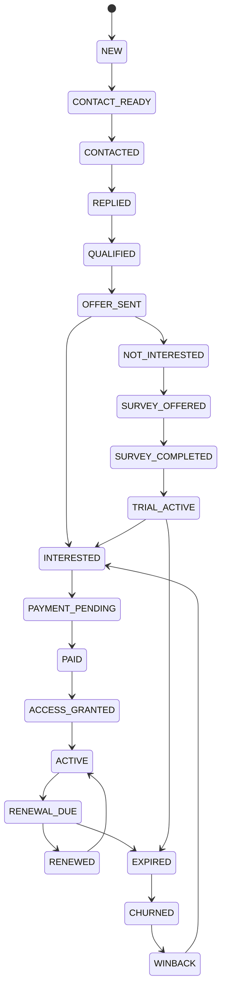

# STATE MACHINE

## Guard rules
- PAYMENT_PENDING → PAID yalnız verified payment event ile.
- PAID → ACCESS_GRANTED valid subscription + policy ile.
- ACTIVE → RENEWAL_DUE süreye göre scheduler ile.
- RENEWAL_DUE → EXPIRED ödeme yoksa.
- EXPIRED → CHURNED grace tamamlanınca.
- Invalid transition = 409 + audit log.

State history append-only tutulur:
from_state, to_state, reason_code, actor_type, actor_id, event_id, created_at.
